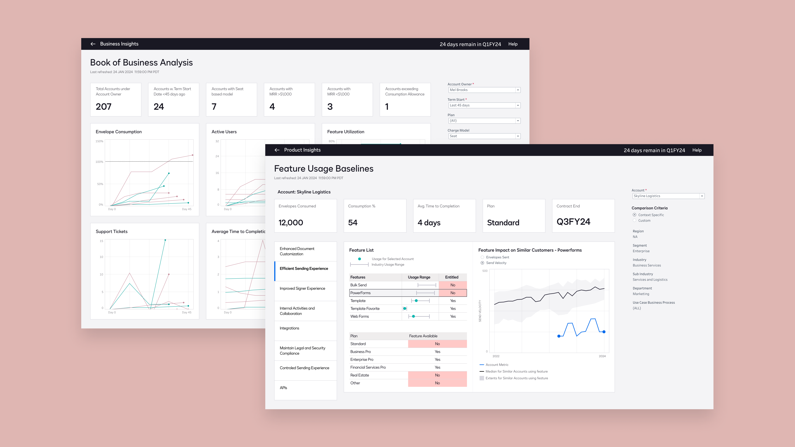
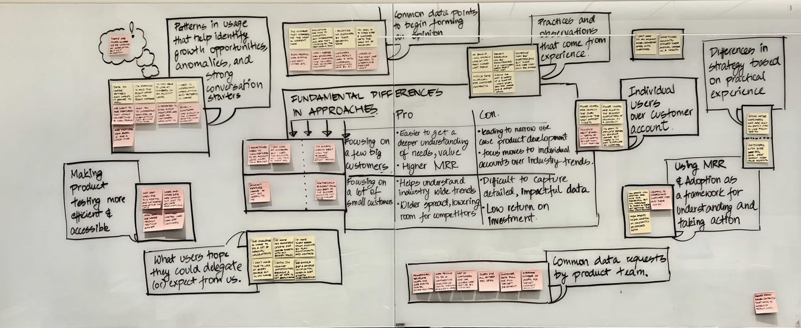
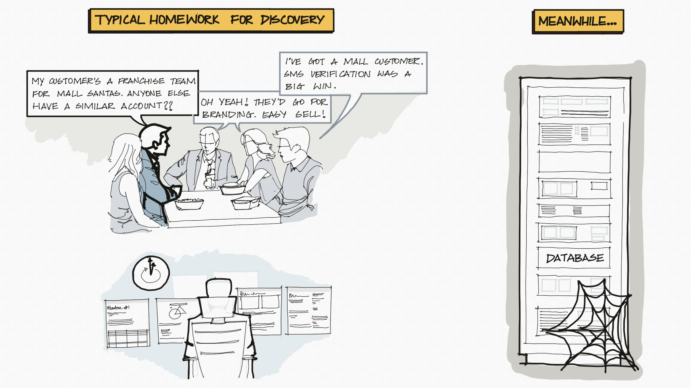
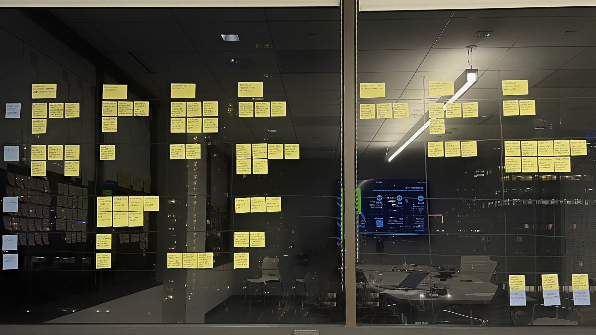
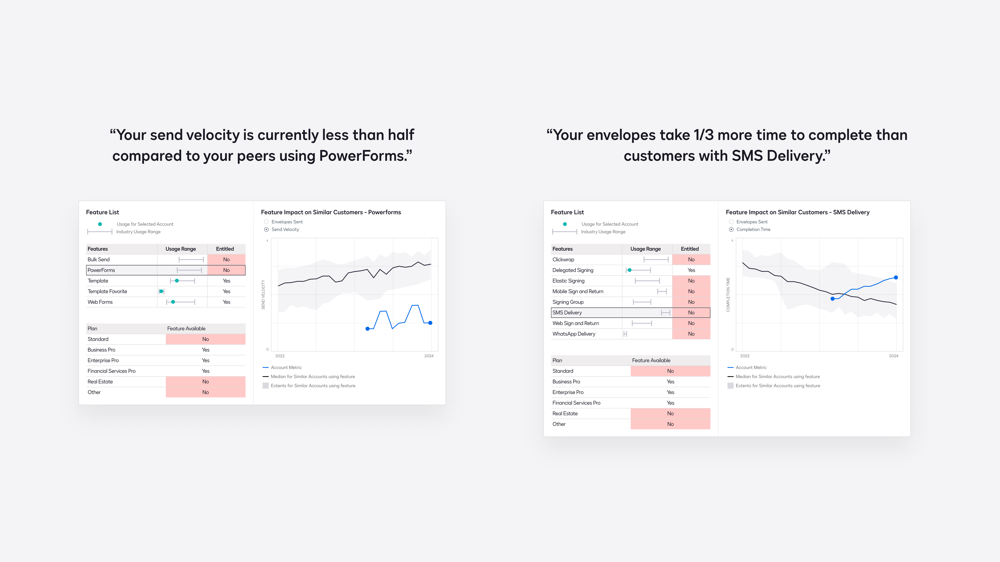
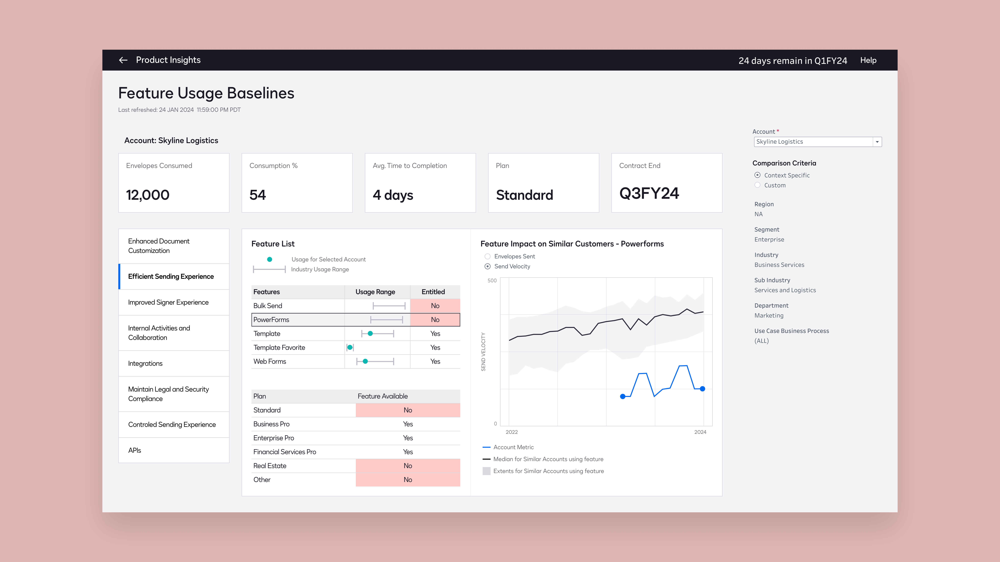
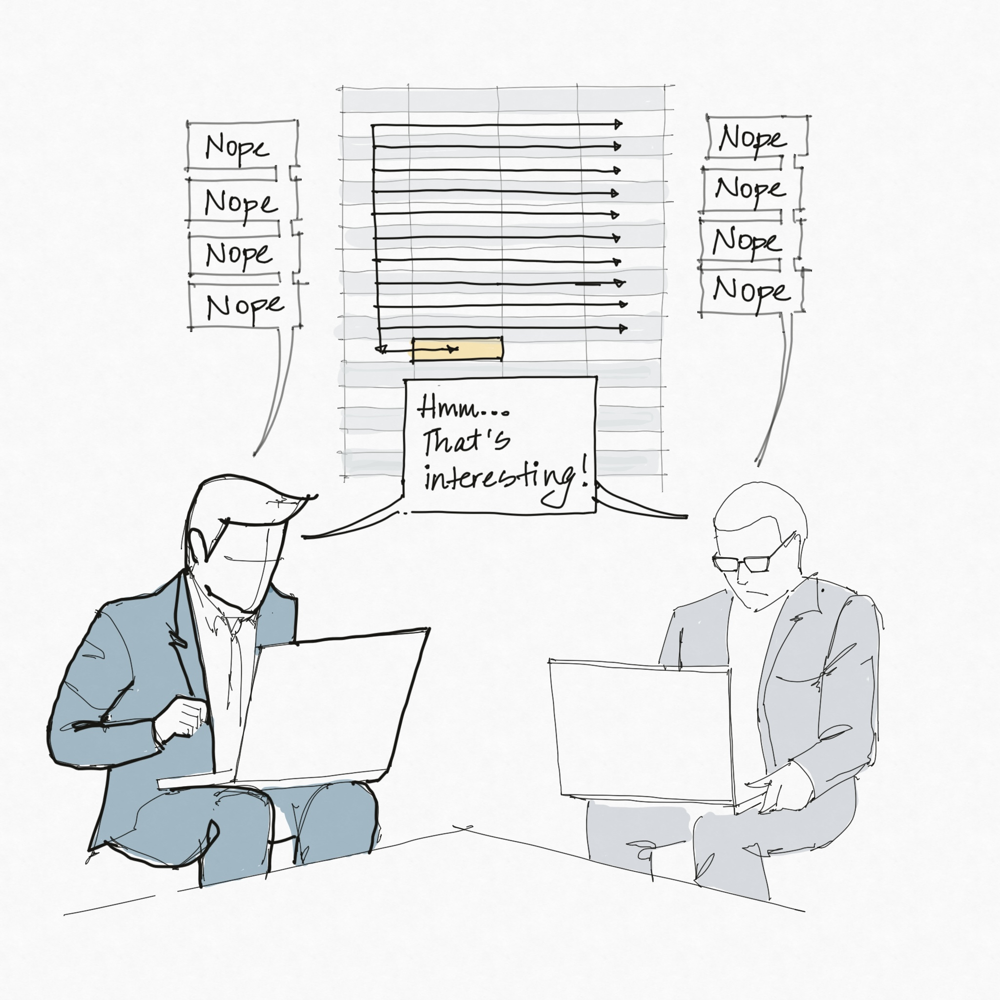
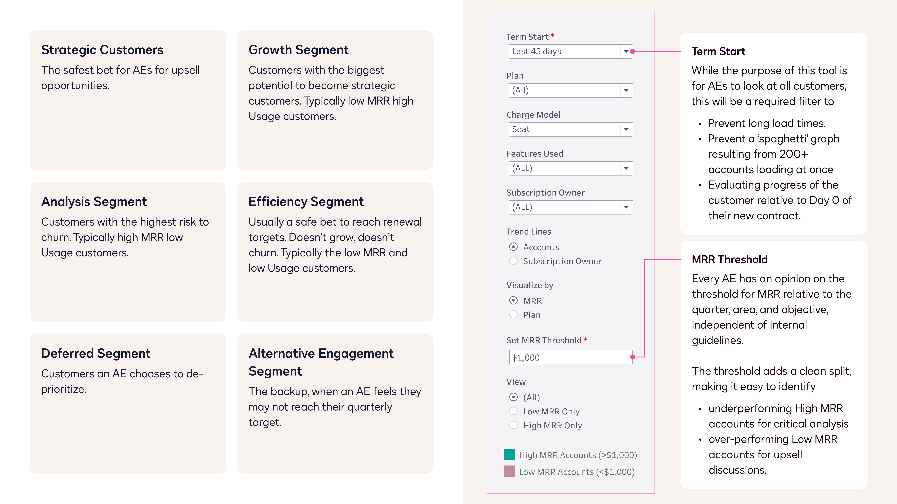
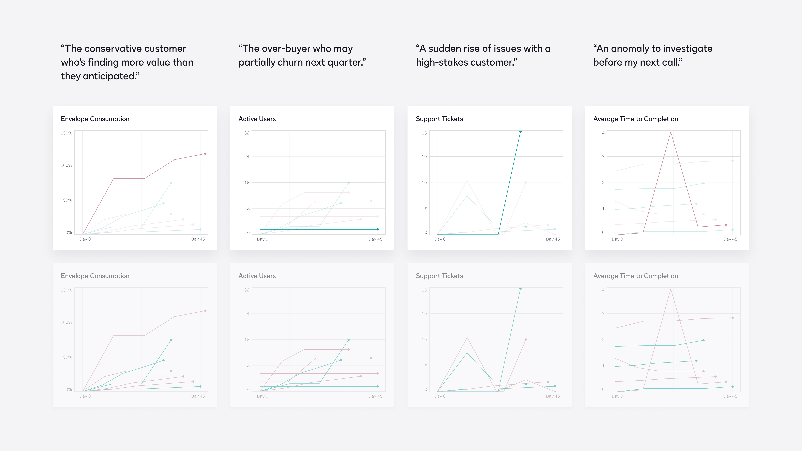
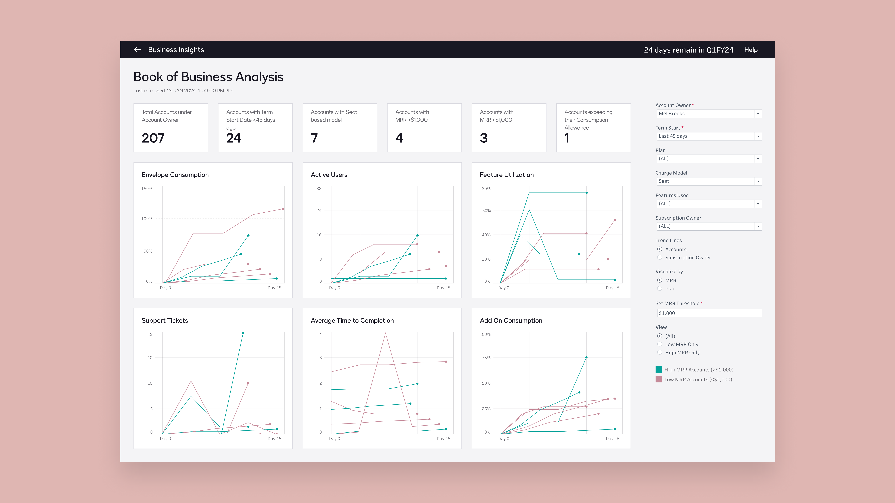

# DocuSign Dashboards - Turning passive reporting tools to action oriented decision tools.

- Source: https://app.notion.com/p/383255400f3f80089aefe5ca32d4b8d8
- Notion page ID: 383255400f3f80089aefe5ca32d4b8d8
- Exported: 2026-07-14

I initiated research to explore how internal dashboards could evolve from reporting metrics to helping teams act on them, resulting in two internal tools:
Feature Usage Baseline leveraged overlooked internal data points, such as “use-case” and “sub-industry” and cross-referenced them with feature success measures, leading to data-driven discoveries for customers and value-driven sales.
Book of Business turned customer metrics into flexible segmentation, helping teams prioritize accounts without separate tracking docs.

**Problem:**
The feature usage dashboard began as one of two different ways to interpret a single hypothesis:
“Rather than understanding performance metrics of a customer QoQ or WoW in isolation, we must understand them relative to a fine-tuned cohort of similar customers.”
While testing design ideas based on this hypothesis, I found a deeper issue. To figure out which features suited a customer, account teams either had to do endless open-ended research or rely on casual conversations with peers.
When I looked at the available schemas in Alation, I saw that the required data was already being collected. It just needed someone to connect the dots.

**Decision:**
I started by reorganizing all features from being grouped by plan to being grouped by the value they offered to customers.

For each feature, the dashboard shows a key success measure for the customer compared to the median, along with the range for similar customers who had purchased that feature.

To find “similar” customers, the tool, by default, selects a cohort of customers that match the selected Salesforce account attributes. The user can still fine-tune the cohort.

**Outcome:**
The tool was designed to make discovery easier. Users said they included snapshots from the tool in their slide decks, resulting in more evidence-based, value-driven sales. Customers were also more willing to pay for features and upgrade their plans when they saw how their peers worked with DocuSign.

**Problem:**
While many metrics were available for internal teams, Account Executives had to update internal documents with their BDRs twice a week to organize the data, prioritize customers, and spot anomalies. This process was especially time-consuming for Mid-Market to Virtual Account Execs, who managed between 200 and 3,000 customers.

**Decision:**
My initial takeaway after speaking with Account Executives was: each AE had a unique approach based on their vertical, customer count, and region. While it remained true, synthesizing the information through different iterations helped me create a 6-bucket model. (with every customer in an AE’s book uniquely fitting in only one bucket)

I started by designing workflows to identify these six customer types. This was later simplified into a set of filters that acted as a custom control center, helping to spot patterns among customers.

**Outcome:**
While the tool saved 4–6 hours per AE and per BDR per week, the real benefit was that teams could iterate faster on their own customer segmentation approach.
For example, an AE would have a fixed threshold of \$1000 MRR to separate high- and low-MRR accounts, but building this tool allowed them to iterate on their notion of high and low MRR accounts.

## Lessons
**Lesson #1: Discomfort is strategy before it has language.**
The roadmap was not a feature request. It was:
**Discomfort → Curiosity → Research → Hypothesis → Design → Test → Validate → Build**
My design work spanned sales, marketing, finance, product, and operations. At that scale, dashboard work can drift toward serving metrics rather than supporting decisions. The signal was discomfort: a sense that more data points existed, but judgment had not become easier.
I saw that discomfort as a sign to improve the product, instead of letting it turn into frustration.
---
**Lesson #2: Range beats rigid expertise.**
This project involved research, synthesis, design, data analysis, storytelling, and delivery.
The fast pace meant there was little time for formalities. I talked to users, found patterns, formed opinions, tested options, refined the system, shaped the story, and pushed the work toward launch.
The key was staying flexible without losing good judgment, and not getting stuck on following the process perfectly.
---
**Lesson #3: Change requires proof and theatre.**
Leaders were not against change itself. They just did not want another dashboard.
I had to present the work as a move from just seeing metrics to making better decisions. By showing how users thought, where they got stuck, and what the new tools enabled, it was easier to get support for the proposal.
The takeaway: the status quo rarely changes through logic alone. It changes when proof is combined with a story people can share.

