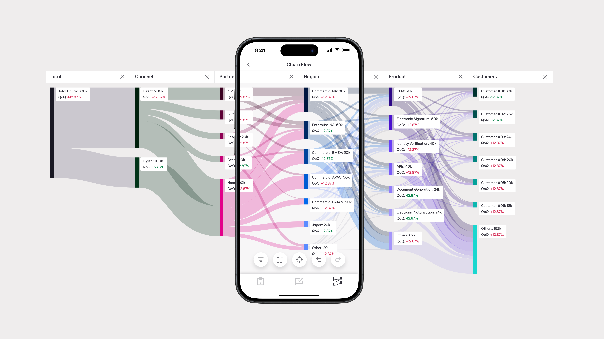
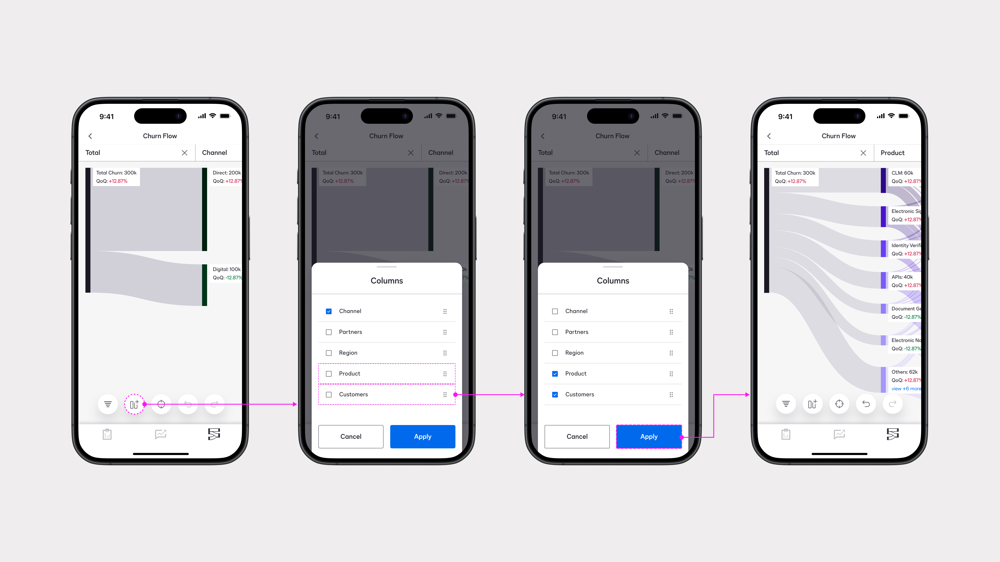
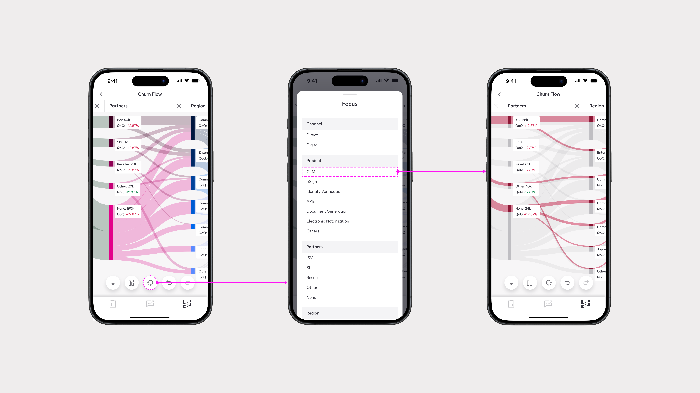
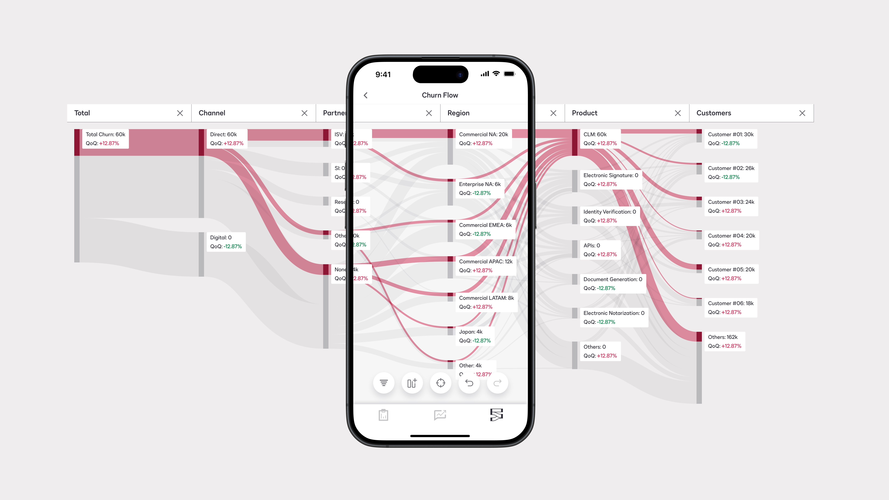
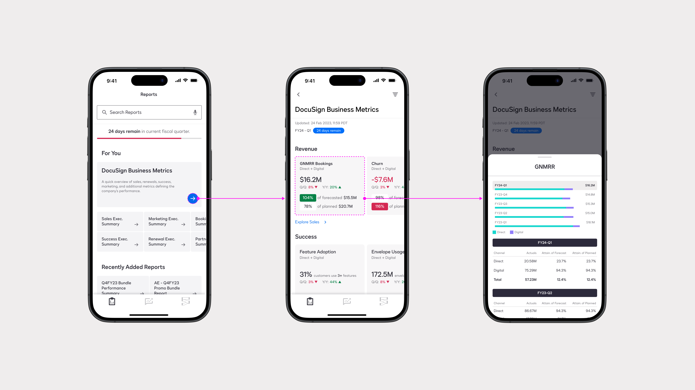
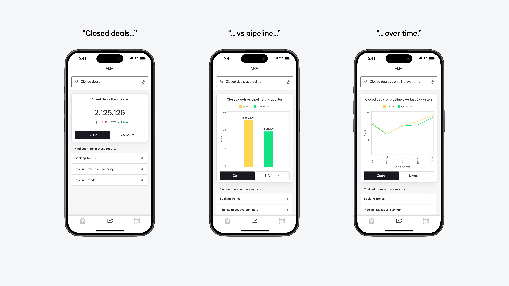

# Mobile App - Defining data analytics experiences for organizational leadership.

- Source: https://app.notion.com/p/383255400f3f8053ab10c083108ef05b
- Notion page ID: 383255400f3f8053ab10c083108ef05b
- Exported: 2026-07-14

After a large-scale migration of the internal dashboards I'd designed for the product, finance, marketing, sales, and executive teams, the Director of Data & Analytics (Piyush Bhargav) asked me to explore how the same data could be made available to VP and C-level leaders on mobile devices.
I set the brief, product requirements, interaction model, and mobile designs. The concept was presented to the C-suite and used to evaluate cost and feasibility.
**Problem #1**
“So… what are we building?”
This was not just a mobile version of the internal tool. It was to be designed as a custom, easy way for a select group to access sensitive data. We also had little insight into how DocuSign executives used company metrics.
**Decision**
To start, I outlined three executive scenarios: reviewing business performance before the day starts, quickly checking data during a meeting, and conducting deeper analysis when time permits.
This approach helped us shift from asking if dashboards could be mobile to defining three main surfaces:
Reports, AMA (Ask Me Anything), and Analysis.
<columns>
	<column>
		
	</column>
	<column>
		
	</column>
	<column>
		
	</column>
</columns>
**Problem #2**
After reviewing dashboards from every department, I saw that each unit could appear as a metric, a dimension, or a filter, depending on which team used it.
The challenge was to create a single analytical layer in which the same unit could appear in all three forms.
**Decision**
To solve this, I designed analytics using a Sankey flow. This allowed users to follow a selected metric through business lenses like Partners, Region, Product, Channel, and Customers. 'Focus' and 'Filters' let users pick from the same dataset (and subsets) as the business lenses.
\[Caption: a user selecting to focus on a selected metric\]
As more Directors shared their priorities, the framework scaled easily. This meant one surface could support deep dives for every business area.

**Problem #3**
The next challenge was fitting the dense internal reporting systems onto a mobile screen.
A key metric is always shown alongside other primary metrics at the same level, with secondary and tertiary metrics below. Clutter is a common issue on desktops, so it has become even more of a problem on mobile devices.
**Decision**
To solve this, I designed the Reports surface with a fixed-format, card-based layout that reads like a news story. Sheets were used to reveal dense information step by step.
I made sure that every dataset with dense information included a visual representation.
This approach allowed me to include every metric without overwhelming viewers with too much information.

**Problem #4**
The last scenario was important because it focused on an executive needing a number during a call. Time-to-value, or how quickly a user can find the right metric, had to be as short as possible for real-time use.
**Decision**
Even though chat-like UIs are common now, I designed AMA with a search bar instead of a chat box. This signaled to users that short phrases were sufficient, as validated through internal testing with directors interacting with the prototypes.
While it gave the impression of sophisticated AI interaction, the outcome could be achieved without LLMs, using low-cost frameworks like Google Action. The design decision had the greatest impact, enabling the project to move toward cost estimation at a time when AI projects were considered too expensive.

Lessons
Lesson #1: Designing for moments a user might want to take out their phone, rather than a ‘mobile version’ of the desktop experience. 
Throughout the process, it was important not to see the experience as ‘fitting a dashboard on a mobile’. That would have limited our possibilities. 
The context was different. C-Suite executives are rarely sitting down to “use software.” They are moving between meetings, checking something before the day starts, looking for a number during a call, or deciding what is worth a deeper look later.
The concept did not gain traction because it was a mobile version of internal dashboards (because it wasn’t). It gained traction because it appeared to have its own place within an executive’s day.

