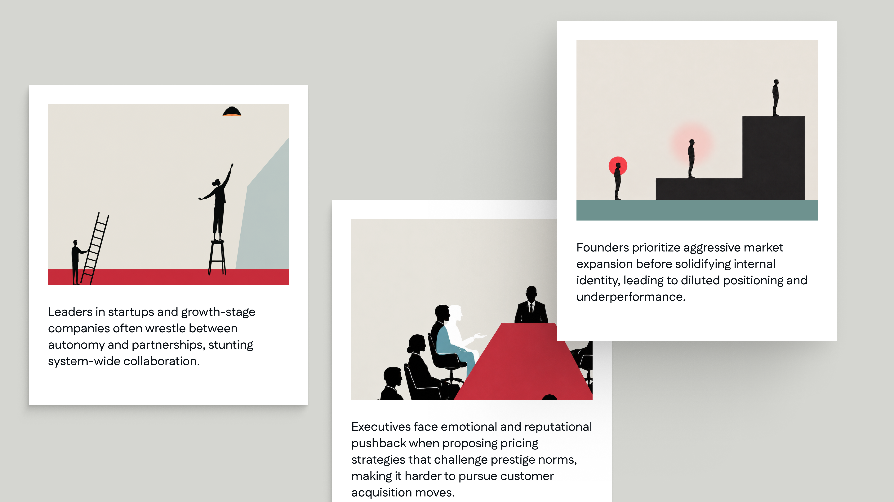
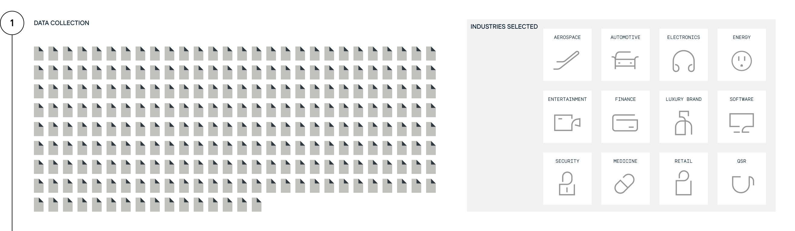
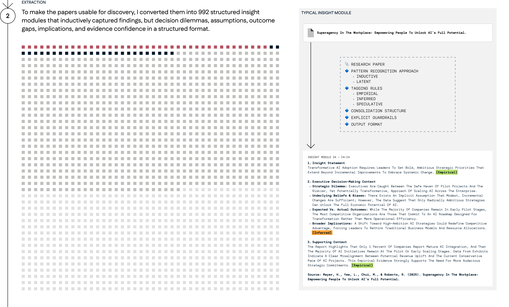
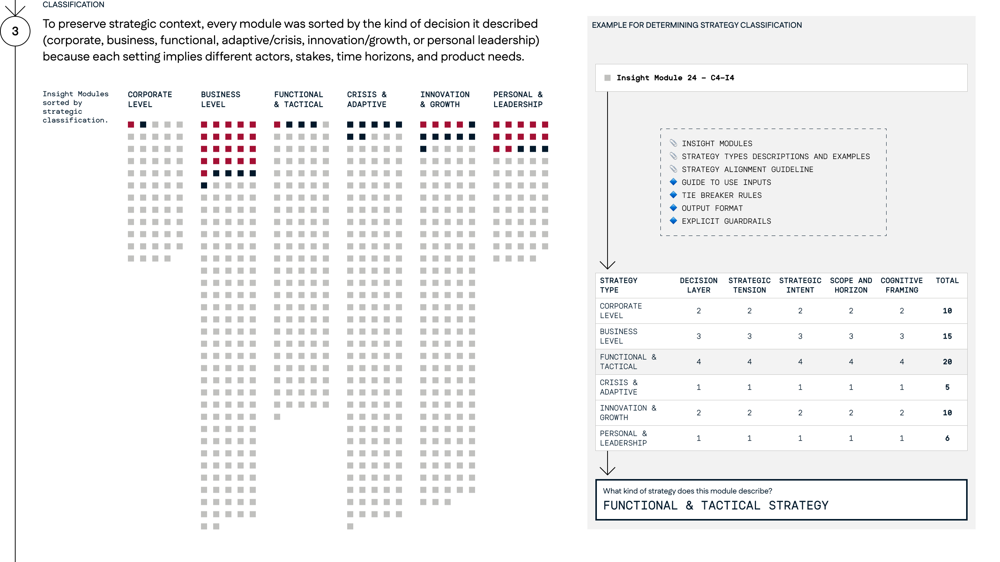
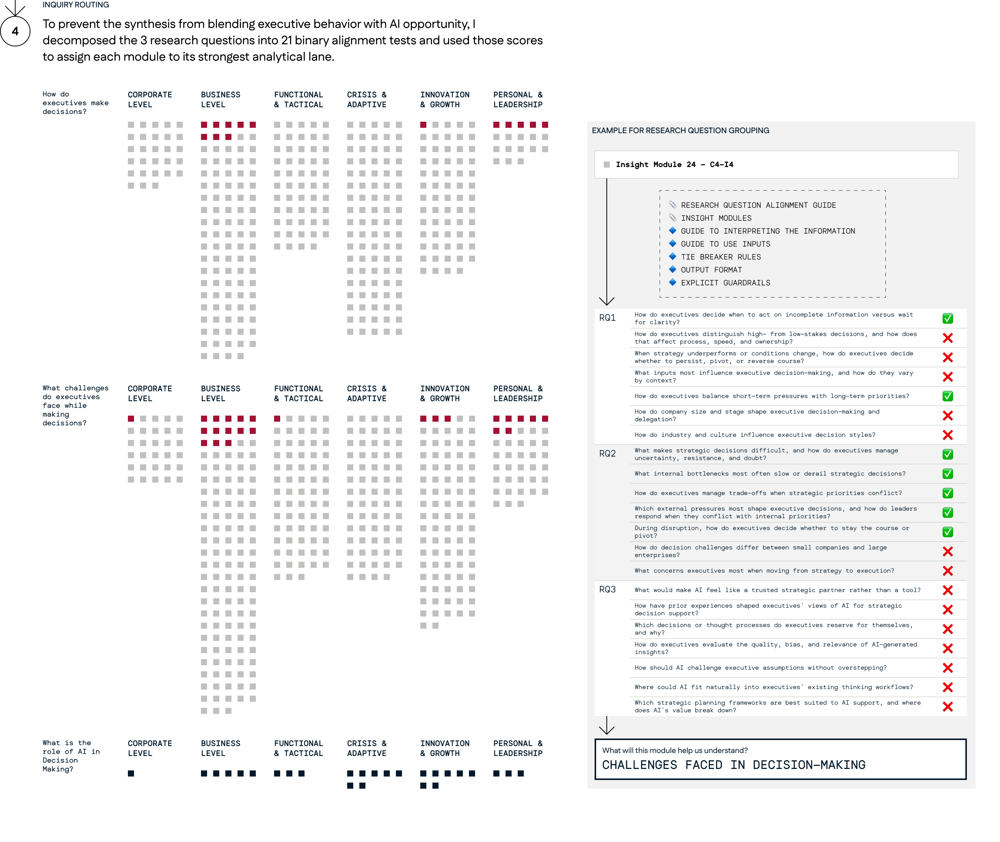
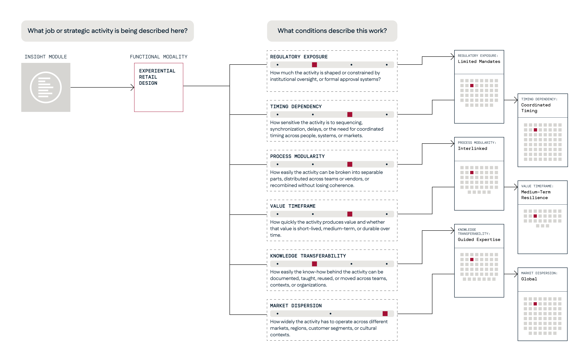
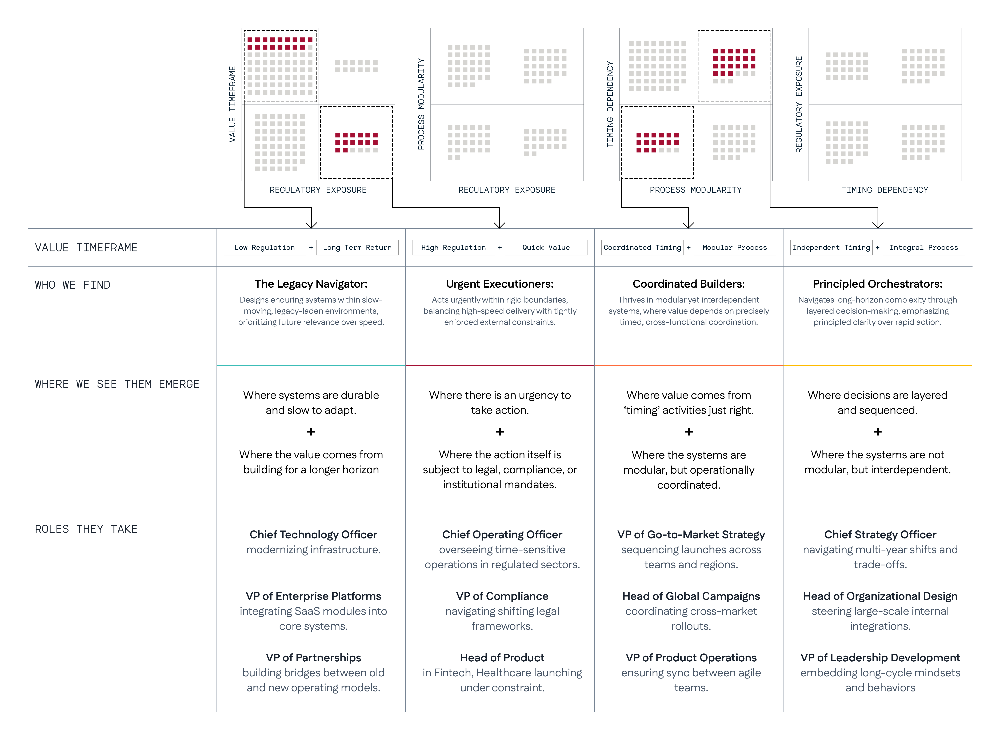
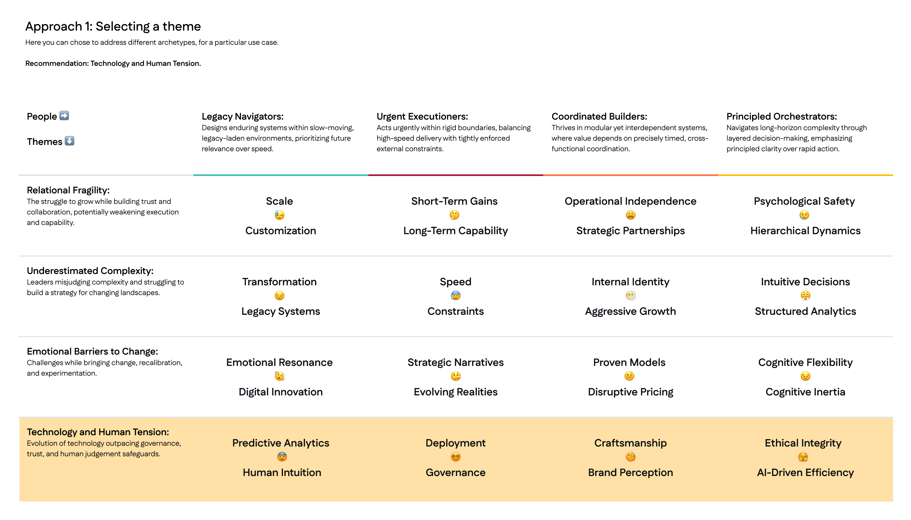
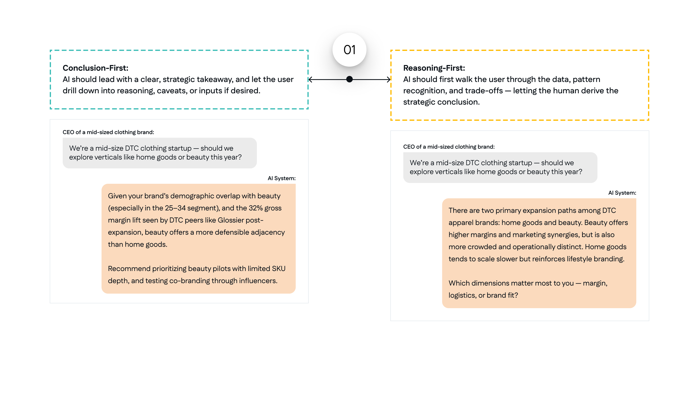

# Harvard Business School - building an AI-enabled research architecture to structure extreme ambiguity.

- Source: https://app.notion.com/p/383255400f3f804188efd766b1a0b854
- Notion page ID: 383255400f3f804188efd766b1a0b854
- Exported: 2026-07-14

The AI team at Harvard Business School set out to create personas for users who would use AI to support strategic thinking, not just production tasks.
To address this, I designed an AI-driven sensemaking system to identify unexplored terrain for AI intervention, along with AI-Human interaction trade-offs specific to strategic thinking rather than the usual use of AI for content generation.
The work provided a foundation for product teams to build on before building. A clearer view of which executive contexts were worth designing for, what current AI tools fail to support, and how AI interaction must change when the goal is judgment rather than output.
**Problem**
The terms “executives” and “strategy” were too broad to treat as just one user group or use case.
**Decisions**
To make the field researchable, I distilled the research into 3 fundamental questions while simultaneously breaking down “strategy” into 6 classifications by combining academic literature and industry contexts.
\[6 classifications\]
Instead of starting with predefined archetypes, I focused on identifying the problems people face and the types of people who show up in those situations or solve those problems.
This choice helped us avoid bias and the limits of my own experience, but it meant the research had to be much larger. To prepare, I used well-known reasoning models at the time: GPT 4o, GPT 4.5, and GPT o3.
\[1st pipeline\]

Reasoning models gave reliable answers but missed hidden meanings. Creativity models could go beyond basic understanding, but they weren’t consistent in applying logic across different sets.
Prompt engineering brought everything together. It let us combine the creative and analytical strengths of GPT 4.5 with the steady reliability of o3. I kept the same goal but tried several versions of the AI pipeline.
\[performance variance improvement map\]
**Problem**
The clusters were still too big to give useful insights, so we tried breaking them down by industry. But this risked turning industries into stereotypes, since even within a single industry, activities can vary widely. (Marketing within Pharmaceuticals, Legal Operations within a Late Night Show)
**Decisions**
To address this, I created a novel approach to mapping activities.
I used situational axes to map each activity along shared scales like regulation, modularity, timing, value horizon, knowledge transfer, and market spread.

This quickly gave us better ways to compare and contrast, helping our team narrow the focus by seeing the extremes and deciding what not to explore further.
\[matrix triangulation\]

I pulled out the four most unique problems for each cluster, creating a 4x4 matrix of business challenges that Generative AI can’t solve on its own. These would need AI to act as a thinking partner, not just a task finisher.

**Problem**
Design principles often sound good but aren’t actually useful. When they become truisms like “AI should be trustworthy,” “prioritize the user,” or “support human judgment,” they’re easy to agree with but hard to use in real design work.
**Decision**
Having many modules in Research Question 3 let us dig deeper and find hidden meanings. This helped me develop a way to frame principles as thoughtful trade-offs, grounded in context rather than as absolute truths.
I wrote each principle so that its opposite could also make sense; something a smart team might choose in another situation or with different goals.
**Outcome**
This allowed us to test different scenarios and contexts, helping us fine-tune the voice of an AI system designed specifically for executives.

\[image carousel for principal slides\]
Lessons:
This was, hands down, the hardest project of my life. Not only was the space too ambiguous and broad, but it also involved
- critically evaluating large blocks of texts,
- …spanning a wide range of industries,
- …in subject matters that was not my expertise,
- ….written by a system I knew was more knowledgeable than I was,
- …in a language that is deliberately designed to sound like an expert.
The biggest challenge was reading well crafted, plausible responses, but constantly wondering if the response was truly accurate or ‘plausibly’ accurate. 
Here are some of my lessons:
**Lesson #1: If we see AI as a very smart output machine, one surprising way to keep up is to continuously move backward.**
For example, if you just ask for an insight, you’ll only get highlights. An AI system might even have its own idea of what ‘insight’ means.
To get an AI to produce something ‘insightful’ within the space means defining what is, and more importantly, what isn’t an insight. It means going back to basics and understanding what makes a sentence insightful, how an insight is pulled from an ocean of data.
Spotting a theme isn’t the same as figuring it out from scratch. Understanding what someone says isn’t the same as finding hidden meanings in their words.
It’s important to know how AI works to use it well, but it might be even more important to keep learning about the fields we think we already know.
**Lesson #2: When you scale up using AI, human-centered discovery can quickly turn into managing a pipeline.**
I realized this when an engineer said, “What you’ve done is built a pipeline. Maybe you should try running it with Gemini or Claude to see how it works differently.”
But seeing this can help us avoid a trap. Otherwise, we might end up admiring the complexity of what we built, instead of remembering that our real goal was to get across, not get stuck in the process.

